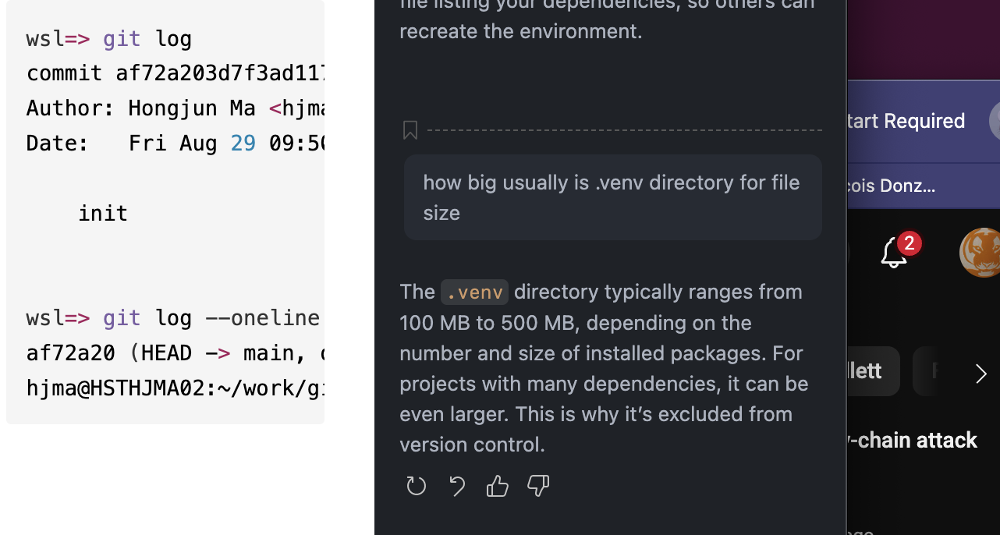

``` bash
wsl=> git log
commit af72a203d7f3ad117654bd9f68071ff9f22a8d5e (HEAD -> main, origin/main)
Author: Hongjun Ma <hjma29@gmail.com>
Date:   Fri Aug 29 09:50:52 2025 -0700

    init


wsl=> git log --oneline
af72a20 (HEAD -> main, origin/main) init
hjma@HSTHJMA02:~/work/git-script
```

