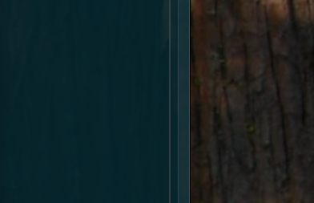

# White Paper: Grafana & Prometheus on HPE GreenLake with NVIDIA

## Introduction
This document provides a technical overview and deployment guide for Grafana and Prometheus in HPE GreenLake environments with NVIDIA hardware.

## Table of Contents
- Installation
- Configuration
- Troubleshooting
- References

## Installation


The repo has many prometheus related charts. The chart we want is called "kube-prometheus-stack". This chart also includes sub-chart of grafana.

### Add repo
```sh
helm repo add prometheus-community https://prometheus-community.github.io/helm-charts
helm repo update
```

### Install
```sh
helm install kube-prometheus-stack prometheus-community/kube-prometheus-stack --namespace monitoring --create-namespace
```

### Helm Search Output
```
prometheus-community/alertmanager                       1.24.0          v0.28.1         The Alertmanager handles alerts sent by client ...
prometheus-community/alertmanager-snmp-notifier         2.0.1           v2.0.0          The SNMP Notifier handles alerts coming from Pr...
prometheus-community/jiralert                           1.8.1           v1.3.0          A Helm chart for Kubernetes to install jiralert
prometheus-community/kube-prometheus-stack              76.3.0          v0.84.1         kube-prometheus-stack collects Kubernetes manif...
prometheus-community/kube-state-metrics                 6.1.4           2.16.0          Install kube-state-metrics to generate and expo...
prometheus-community/prom-label-proxy                   0.15.0          v0.12.0         A proxy that enforces a given label in a given ...
prometheus-community/prometheus                         27.30.0         v3.5.0          Prometheus is a monitoring system and time seri...
prometheus-community/prometheus-adapter                 5.1.0           v0.12.0         A Helm chart for k8s prometheus adapter
```

> [!Note]
> Was trying to configure grafana to be NodePort but got confused for a long time why "show value" for chart don't show the grafana.service.type while the installed release shows. The "show value" only shows parent prometheus value while "get values" show the merged values after installation.


---



*Continue to add sections as you curate your notes.*
